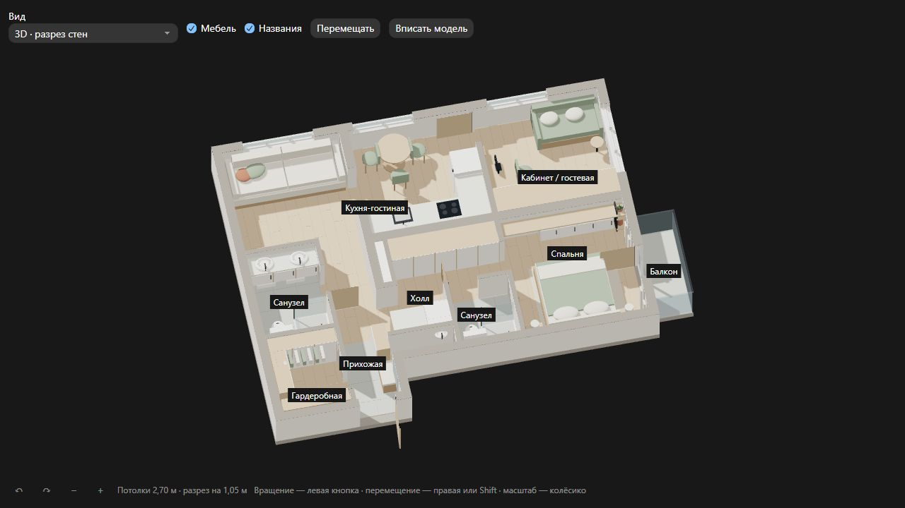

# Хатка — 3D-модель квартиры

Сайт на React, TypeScript, Three.js и Vite, подготовленный из архива `apartment-3d.zip`.
Геометрия квартиры и исходные материалы сохранены. Интерфейс на русском языке.

## Запуск

Нужен Node.js 22.12+ в ветке 22 или Node.js 24+ с npm.

```sh
npm install
npm run dev
```

Откройте <http://127.0.0.1:5173>. На Windows при блокировке `npm.ps1` используйте
`npm.cmd install` и `npm.cmd run dev`.

Для повторной установки точных версий из `package-lock.json` используйте `npm ci`.
Интернет нужен для установки зависимостей. Сам сайт загружает библиотеку и модель
со своего сервера; внешних CDN, шрифтов и сервисов нет.

## Команды

| Команда                | Назначение                                          |
| ---------------------- | --------------------------------------------------- |
| `npm run dev`          | Локальный сервер с обновлением при изменении файлов |
| `npm run build`        | Проверка типов и сборка сайта в `dist/`             |
| `npm run preview`      | Просмотр сборки на <http://127.0.0.1:4173>          |
| `npm test`             | Проверка данных модели, сцены и расчётов камеры     |
| `npm run typecheck`    | Строгая проверка TypeScript, включая тесты          |
| `npm run format`       | Форматирование TypeScript, TSX, CSS и документации  |
| `npm run format:check` | Проверка форматирования                             |

Открывать `index.html` двойным щелчком не нужно: ES-модули и загрузка JSON требуют
HTTP-сервера. Для публикации на статическом хостинге используется содержимое `dist/`.
Относительные пути в настройке Vite позволяют размещать сборку в подкаталоге,
в том числе на GitHub Pages.

### GitHub Pages

В репозитории уже есть workflow `.github/workflows/deploy-pages.yml`: он собирает
проект и публикует `dist/` после каждого push в ветку `main`. Один раз включите
`Settings → Pages → Build and deployment → Source: GitHub Actions`. После этого
адрес опубликованного сайта появится в окружении `github-pages` у workflow.

## Структура

```text
index.html                    HTML-оболочка и точка монтирования React
src/
  main.tsx                    Запуск React в StrictMode
  App.tsx                     Состояние настроек и компоновка страницы
  components/
    ViewerToolbar.tsx         Выбор вида, переключатели и вписывание
    ViewerViewport.tsx        Область 3D, состояние загрузки и ошибки
    ViewerFooter.tsx          Кнопки камеры, статус и подсказки
  hooks/useApartmentViewer.ts Загрузка, синхронизация и очистка просмотрщика
  model/
    types.ts                  Типы геометрии, материалов и помещений
    parse-model.ts            Проверка JSON перед созданием сцены
  styles.css                  Стили, светлая/тёмная тема и адаптивность
  viewer/
    index.ts                  API и жизненный цикл просмотрщика
    scene.ts                  Геометрия, свет, материалы и разрез стен
    camera.ts                 Камера, масштаб, перемещение, вписывание
    controls.ts               Мышь и жесты двумя пальцами на canvas
    labels.ts                 Подписи помещений поверх модели
    options.ts                Режимы просмотра и начальные настройки
    types.ts                  Типы настроек, API и камеры
public/
  models/apartment/
    model.json                Параметры 566 объектов и подписи помещений
    apartment.glb             Модель для скачивания и импорта в Blender
    apartment.obj             Запасной формат модели
    apartment.mtl             Материалы OBJ; хранить рядом с OBJ
  preview.png                 Исходное изображение модели
scripts/build_model.py        Параметрический генератор моделей
tests/viewer.test.ts           Проверки сцены и камеры
tests/model.test.ts            Проверки некорректных данных модели
docs/original-validation.json  Отчёт проверки из исходного архива
reference/                    Исходные HTML и README для справки
```

`reference/` не участвует в сборке. Его README описывает расположение файлов
в исходном архиве; актуальная структура приведена выше. `viewer-fragment.html`
содержит шаблон с подстановкой модели, а `viewer.html` — старую автономную версию
с внешними CDN. Код для дальнейшей разработки находится в `src/`.

React управляет состоянием интерфейса и событиями кнопок. Three.js подключается
отдельным модулем при загрузке модели и получает настройки через типизированный
`ViewerHandle`. Переключатели обновляют существующую сцену, сохраняя положение камеры;
смена режима просмотра заново вписывает квартиру.

Хук `useApartmentViewer` отменяет незавершённую загрузку при размонтировании и освобождает
canvas, геометрию, материалы, наблюдатель размера и обработчики жестов. Это также
поддерживает повторный запуск эффектов в StrictMode и React Fast Refresh.
Проверка TypeScript включена в сборку; тесты TypeScript запускаются через `tsx`.

## Управление

- **Вид:** разрез на высоте 1,05 м, полные стены 2,70 м или план сверху.
- **Вращение:** левая кнопка мыши; также кнопки ↶ и ↷.
- **Перемещение:** правая/средняя кнопка мыши, Shift + перетаскивание либо кнопка «Перемещать».
- **Масштаб:** колёсико к точке под курсором, кнопки −/+ или жест двумя пальцами.
- **Вписать модель:** вернуть всю квартиру в видимую область.
- **Мебель / Названия:** переключение видимости. В режиме полных стен названия скрыты.

На узких экранах в 3D остаются подписи основных комнат; в плане сверху отображаются все.
Для 3D нужен браузер с WebGL. При ошибке запуска остаётся ссылка на скачивание GLB.

## Изменение модели

Геометрия и материалы задаются в `scripts/build_model.py`. Для их пересоздания нужен
Python 3, дополнительные Python-пакеты не требуются:

```sh
python scripts/build_model.py
```

На Windows можно использовать `py scripts/build_model.py`, если установлен Python Launcher.
Скрипт обновляет `model.json`, GLB, OBJ и MTL в `public/models/apartment/` независимо
от текущей рабочей папки. Затем обновите страницу; для публикации снова выполните сборку.

Чтобы сохранить результат в отдельную папку:

```sh
python scripts/build_model.py --output-dir .tmp/model-export
```

Просмотрщик строит геометрию из `model.json`; GLB служит отдельным экспортом.
Ручные изменения JSON будут перезаписаны при запуске генератора. `preview.png` и
`docs/original-validation.json` сохранены из архива и автоматически не обновляются.

Модель — приблизительная реконструкция по фотографии планировки, размеры указаны
в метрах. Исходные допущения, контрольные размеры и рекомендации по импорту сохранены
в [описании модели](reference/README.md).


