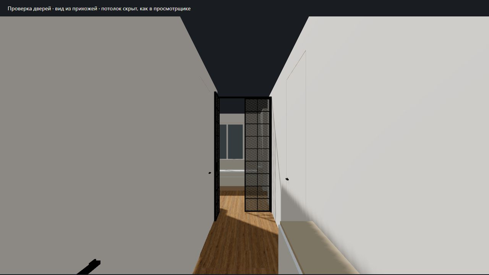

# Двери: реализация первого варианта

Актуально на 2026-09-30. После [исследования](door-rework-research.md)
пользователь разрешил реализацию, задал высоты и разрешил приближённые сечения,
зазоры, ручки и стекло по референсу. Во время работы добавлена дверь кабинета:
скрытый монтаж, 2400 мм. Коммитов и push нет.

## Результат и основания

| Узел                      | Сохранённый проём | Новый вариант                                                                              | Источник                                                                                                                                 |
| ------------------------- | ----------------: | ------------------------------------------------------------------------------------------ | ---------------------------------------------------------------------------------------------------------------------------------------- |
| Большой санузел           |            800 мм | Закрытое скрытое полотно 2400 мм, в цвет стены                                             | Ширина — подпись PDF; высота и тип — пользователь                                                                                        |
| Левая гардеробная         |            800 мм | То же                                                                                      | Ширина — принятая геометрия плана; высота и тип — пользователь                                                                           |
| Мастер-гардеробная справа |            923 мм | То же                                                                                      | Ширина — отдельная подпись PDF; назначение, высота и тип — пользователь                                                                  |
| Кабинет                   |            900 мм | То же; заподлицо со стороны кухни                                                          | Ширина — подпись PDF; высота и тип — дополнительное указание пользователя                                                                |
| Вход в кухню-гостиную     |           1200 мм | Рамная группа 2550 мм, две равные створки, левая открыта на 90° в прихожую, правая закрыта | Ширина — существующие грани; высота, две распашные створки и положение — пользователь; симметрия и детализация — разрешённое приближение |

Дверь спальни, её раздвижное полотно и карман сохранены. Входная дверь,
малый санузел и балкон также сохраняют прежнюю геометрию. Отдельный проход
1324 мм между гостиной и кухней не занят новой группой.

[Генератор дверей](../src/modeling/shell/doors.ts) содержит параметры и реестр
семи составных объектов измерения. Для скрытого монтажа убраны длинные условные
цилиндры петель, добавлены небольшие тёмные ручки с двух сторон. Видимая сторона
полотна совпадает с плоскостью стены. Четыре перемычки подняты, ширины и позиции
проёмов сохранены. Другая мебель и стены не перестраивались.

Параметры приближения, **не монтажная спецификация**:

- Скрытое полотно: толщина 40 мм, боковые/верхний зазоры 4 мм.
  Низ Y=28 мм, верх Y=2428 мм; перемычка начинается на Y=2432 мм.
  Высота самого полотна точно 2400 мм. Общая исходная отметка группы Y=24 мм
  находится выше прежних отделочных поверхностей 18–22 мм.
- Рама стеклянной группы: видимая ширина 28 мм, глубина 50 мм, без нижнего
  неподвижного порога. Низ Y=24 мм, верх Y=2574 мм; до потолка остаётся 126 мм.
  Новая фрамуга не добавлялась.
- Каждая стеклянная створка: 565×2510 мм, глубина контура 38 мм.
  Контур 22 мм, внутренняя раскладка 10 мм, стекло условно 8 мм.
  Две колонки и девять рядов, по 18 вставок на створку. Размер створки и световой
  проход различаются; одна открытая створка даёт заметно меньше 600 мм свободной
  ширины. Вторую в первом варианте показали закрытой.
- Рама находится на Z=3171 мм, рядом с северной стеной большого санузла,
  X=1935…3135 мм. Это выбор установки для визуализации, не новый обмер.
  Ручка открытой левой створки вынесена в проход, чтобы не пересекать левую стену.

## Материалы, измерения и экспорты

Прежние 20 материалов сохранены, добавлены `door_metal` и `door_glass`.
Полотна используют `wall`, поэтому совпадают со стенами и после осветления
штукатурки в viewer.

[Рельеф стекла](../src/viewer/door-glass-relief.ts) — одна детерминированная
RGBA-текстура 128×128, общий рисунок цвета и bump map. Целочастотные волны
создают повторяемую водную фактуру; UV каждой вставки используют один период.
Это приближение без оптического преломления и размытия предметов за стеклом.
В «Качестве» применяется существующее окружение сцены; в остальных профилях
рисунок тоже виден. Прозрачные вставки не отбрасывают сплошную тень.

Текстура принадлежит [пулу ресурсов](../src/viewer/scene-resources.ts):
новый экземпляр на каждый mount, однократный dispose. JSX-материалы заимствуют
карты и очищаются R3F.

[Измерения](../src/modeling/measurements.ts) объединяют каждую скрытую дверь,
раму и обе стеклянные створки. Планки, вставки и ручки получают ID своего объекта;
отдельные ложные «полотна» не появляются. Для скрытой двери измеряется **весь блок**,
включая контур зазоров и ручки: высота 2408 мм и глубина 94 мм отличаются от
размера полотна 2400×40 мм. Рама и стеклянные створки доступны раздельно.
Габариты не названы размерами светового прохода; основания раскрываются в панели.

`model:build` регенерировал JSON/GLB/OBJ/MTL. Геометрия и простые цвета новых
дверей входят в экспорты; процедурный рельеф стекла и пробная отделка пола
остаются в viewer. «Исходный GLB» обозначает экспорт без этих пробных материалов,
а не прежнюю геометрию квартиры.

Итог — 710 деталей, 22 материала, 9 подписей, 139 объектов измерения.
Отличия от этапа пола проверены до добавления нового эталона:

- Удалены четыре открытых полотна и четыре условные петли.
- Изменены только четыре перемычки над этими проёмами.
- Добавлены 32 детали скрытых дверей и 67 деталей стеклянной группы.
- Остальные детали, прежние материалы, подписи, контуры комнат и план пола
  сохранены. Спальня и карман проверены отдельно.

[Новый эталон и правила](../tests/fixtures/README.md).
Исторические этапы пола и измерений проверяются на своих сохранённых fixtures.
Актуальная генерация сравнивается с эталоном дверей; самостоятельные проверки
64 размеров PDF остаются на текущем генераторе.
[Проверки геометрии, группировки и владения текстурой](../tests/doors.test.ts).

## Браузерная проверка

Проверены cut/full/top, три профиля графики, скрытие/возврат мебели и названий,
кнопки камеры, крайние значения среза 0,30/2,70 м и измерения кабинета/левой створки.
Список содержит четыре скрытые двери, раму и две створки. Проверены окна
390×844 и 844×390 CSS px, переключение режима и мобильный выбор двери;
горизонтального переполнения страницы нет.

Через существующий диагностический экран выполнен повторный mount текущего App
в StrictMode: при unmount — ноль root/canvas, после mount — по одному;
показатель кадра между mounted и idle не изменился.
[Результат](assets/doors-2026-09-30/remount.json).
Ошибок и предупреждений в консоли этих проверок нет. Node-тест отдельно
проверяет независимость текстур и однократное освобождение при повторном cleanup.

Сохранены [полный вид](assets/doors-2026-09-30/full-desktop.png),
[измерение кабинета](assets/doors-2026-09-30/study-measurement.png),
[мобильный план](assets/doors-2026-09-30/top-mobile.png) и
[горизонтальное окно](assets/doors-2026-09-30/cut-landscape.png).
Для рассмотрения композиции изнутри добавлена
[диагностическая камера](assets/doors-2026-09-30/detail.html) с тем же ApartmentScene,
геометрией и материалами. Это dev-страница, не новый режим управления основного
просмотрщика. Потолок на ней тоже скрыт.

Typecheck, 96 тестов, build/model:check и format:check прошли.
Production preview проверен на 390×844 и 844×390 CSS px: загрузка модели,
переключение режима, выбор двери кабинета, resize и консоль. Сборка сохраняет
предупреждение Vite о размере viewer chunk (649,97 kB), которое не прерывает её.
