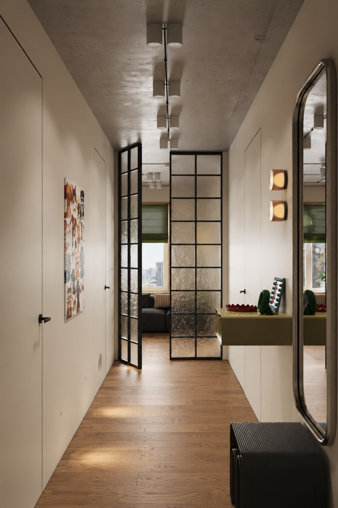

# Двери прихожей и стеклянный вход в кухню-гостиную

Актуально на 2026-09-30. Исследование проведено до реализации: изучены
изображение, исходники генератора, аудит планировки и документация производителей.
На этапе исследования геометрия, код и экспорты не менялись. Позднее пользователь
разрешил реализацию, задал высоты 2400/2550 мм, приближённую детализацию и положение
створок, добавил скрытую дверь кабинета. Итог — в
[описании реализации](door-rework-implementation.md). Привязки ниже описывают
исходную модель до этого этапа.

## Что согласовано пользователем

- Слева в прихожей — двери скрытого монтажа в гардеробную и большой санузел.
- Справа — скрытая дверь в гардеробную при мастер-спальне. Это вход в другое
  помещение, не дверь самой спальни.
- Дверь самой спальни сохраняется: нынешнее раздвижное полотно и его карман
  не входят в эту задачу.
- Впереди — входная группа в кухню-гостиную с **двумя распашными створками**.
  Этот тип конструкции явно подтверждён пользователем после первоначального
  разбора изображения. Неподвижная правая секция не является выбранным вариантом.
- Первоначальный объём — исследование и фиксация данных. Позднее кабинет
  включён в реализацию отдельным указанием: скрытая дверь 2400 мм.
  Входная дверь квартиры, малый санузел и балкон сохраняются.

## Референс и визуальные признаки

Изображение сохранено без изменений из вложения
`codex-clipboard-cca1225f-c7d3-4188-880c-60e24e560ffb.png`.
Назначения помещений берутся из пояснений пользователя. Кадр служит источником
внешнего вида, а не обмером или рабочим чертежом.

| Узел              | Что видно                                                                                               | Что по изображению не установлено                                                                 |
| ----------------- | ------------------------------------------------------------------------------------------------------- | ------------------------------------------------------------------------------------------------- |
| Три боковые двери | Светлые гладкие полотна в цвет стен, без выступающих наличников; тонкий контур и небольшие тёмные ручки | Точный цвет, размеры, устройство короба, петли, направление открывания и величина зазоров         |
| Стеклянная группа | Высокие чёрные рамные створки, повторяющаяся прямоугольная сетка; слева створка открыта, справа закрыта | Металл профиля, сечение, размеры створок, сторона петель, замок и точное положение рамы в проходе |
| Заполнение        | Светопропускающее стекло с нерегулярным рельефным рисунком, заметно искажающим вид за ним               | Производитель, узор, толщина, тонировка и обработка стекла                                        |
| Верх группы       | Рама подходит близко к потолку                                                                          | Реальная высота, верхний монтажный зазор, наличие отдельной фрамуги                               |

На правой закрытой створке визуально читается одна средняя вертикаль и восемь
внутренних горизонталей: примерно **2 столбца × 9 рядов ячеек**. Это наблюдение
по кадру, не утверждённая раскладка. Центральный стык двух створок следует
отличать от средних вертикалей внутри каждой створки.

Рисунок стекла ближе к нерегулярной «водной» или зернистой фактуре, чем к
равномерным вертикальным рёбрам. Это визуальная интерпретация: конкретный
рисунок по одному кадру не определён. Матовая непрозрачная вставка потеряла бы
важный признак референса — видимость света и искажённых силуэтов за стеклом.

## Привязка к существующей модели

Источник размеров модели — «Итоговая планировка.pdf», лист 09, как зафиксировано
в [аудите](plan-dimension-audit.md) и [реестре](plan-dimensions-audit.json).
В этом исследовании исходный PDF заново не измерялся. Подписанные размеры
и координаты модели относятся к дизайн-проекту, не к обмеру после отделки.

Положение рассматривается при взгляде от входа квартиры к гостиной:
в мировых координатах движение примерно от Z=7,9 к меньшему Z.
Слева расположена стена X=1,835…1,935 м; справа — возврат
X=3,135…3,385 м. Такое соответствие фотографии и плана является пространственной
интерпретацией, опирающейся на пояснения пользователя.

| Узел                                  | Техническое имя сейчас   | Ширина прохода в модели | Основание ширины                                                          | Нынешнее полотно, Ш×В×Т                       |
| ------------------------------------- | ------------------------ | ----------------------: | ------------------------------------------------------------------------- | --------------------------------------------- |
| Большой санузел слева                 | `Bathroom 1 door open`   |                  800 мм | Подписанный размер PDF, реестр `pdf-line-9529`                            | 720×2090×40 мм                                |
| Гардеробная слева                     | `Cloakroom door open`    |                  800 мм | Координаты принятого плана; отдельная подпись ширины в реестре не найдена | 720×2090×40 мм                                |
| Гардеробная при мастер-спальне справа | `Hall utility door open` |                  923 мм | Отдельно прочитанная подпись PDF в `additionalPrintedDimensions`          | 843×2090×40 мм                                |
| Вход из прихожей в гостиную впереди   | Отдельной двери нет      |                 1200 мм | Разность существующих граней: 3135 − (1835 + 100)                         | Полотен, рамы и перемычки поперёк прохода нет |

Привязки в [плане](../src/modeling/plan.ts) и
[оболочке](../src/modeling/shell/walls.ts):

- Большой санузел: стена X=1,835…1,935 м, проём вдоль Z=4,113…4,913 м.
- Левая гардеробная: та же плоскость стены, Z=6,765…7,565 м.
- Правая мастер-гардеробная: стена X=3,135…3,385 м, Z=4,748…5,671 м.
  В коде и прежнем аудите это «хозблок»/`utility`; шкаф
  `Hall wardrobe 2866 x 650` находится в зоне холла восточнее. Для текущего
  замысла назначение двери уточнено пользователем. Различие названий само
  по себе не требует перестройки стен, комнаты или шкафа.
- Фронтальный проход: X=1,935…3,135 м рядом с северной стеной большого
  санузла, около Z=3,17 м. Точная плоскость установки новой рамы ещё не выбрана.

**1200 мм и 1324 мм — разные проходы.** `PLAN.living.passage = 1.324`
описывает внутренний боковой разрыв между гостиной и кухней в стене
X=3,135…3,385 м, вдоль Z=1,075…2,399 м. Подпись PDF «Разрыв между верхним
и нижним простенками» относится к нему, а не к фронтальной стеклянной группе.
Проход 892 мм рядом с консолью находится глубже в прихожей и тоже не задаёт
ширину новой группы.

Высота трёх существующих боковых проёмов — 2100 мм; полотна — 2090 мм.
Это прежние схематичные значения, а не высоты из PDF или референса.
Потолок 2700 мм задан прежним условием пользователя. Фронтальный проход сейчас
не имеет отдельной верхней перемычки. Новая высота скрытых дверей, высота
стеклянных створок и вариант примыкания к потолку пока не утверждены.

Нынешнее открытое положение тоже схематично. Полотно правого входа развёрнуто
от петли в коридор по −X; левая гардеробная — по −X внутрь неё;
большой санузел — по +X в коридор. Это факты текущего генератора, не принятая
схема будущего открывания.

## Конструктивные аналоги из первичных источников

### Скрытые распашные двери

[ECLISSE Syntesis Line Battente](https://www.eclisse.com/en/products/collection/syntesis-collection/syntesis-line-battente/)
показывает нужный принцип: полотно заподлицо со стеной, скрытая рама без
наличников, окраска вместе со стеной. Система имеет варианты push/pull,
правое/левое открывание и исполнение без верхней перекладины; производитель
описывает высоту до 2700 мм. Это подтверждает существование подходящего
решения, но не выбирает товар и размеры для квартиры.

Для боковых дверей сначала нужно определить, **с какой стороны полотно должно
быть заподлицо**, затем сторону петель и открывание. У всех трёх дверей важен
вид из прихожей. Совпадение окраски само по себе не заменяет правильную посадку
полотна в плоскость стены. Для санузла отдельно остаются отделка и фурнитура
конкретного изделия; их характеристики по фотографии не устанавливаются.

### Чёрная рамная группа

[Jansen Art’15](https://www.jansen.com/nl-nl/steel-systems/producten/detail/jansen-art15-deur.html)
— пример стальной системы для внутренних дверей и перегородок, с одно- и
двустворчатыми вариантами. Производитель указывает глубину 50 мм, видимую
ширину профиля створки 43 мм и узел центрального стыка 66 мм; размеры створки
до 900×2400 мм. Эти параметры показывают реальную конструктивную разницу между
тонкой внутренней раскладкой и несущим контуром. Название Art’15 не означает,
что весь периметр двери имеет ширину 15 мм.

Высоту 2700 мм для стеклянных **створок** этот пример не подтверждает.
Если выбран вход до потолка, надо отдельно рассмотреть высокую заказную систему
или створки с верхней неподвижной фрамугой. Фрамуга — возможное техническое
решение, не часть уже утверждённого замысла. Материал рамы на референсе
неизвестен; сталь — один из найденных аналогов, не установленный факт.

При симметричном делении 1200-мм прохода на каждую половину приходится 600 мм
**до** вычета короба, центрального стыка и монтажных зазоров. Рабочий проход
через одну открытую створку будет меньше 600 мм. Поэтому обе створки должны
открываться, а симметрия или разная ширина остаются отдельным решением.
Точный световой проход считается по выбранному сечению, не по ширине картинки.

### Фактурное стекло

[AGC Imagin](https://www.agc-yourglass.com/de-DE/marken/imagin) — узорчатое
светопропускающее стекло для дверей и перегородок. Среди рисунков есть
Kathedral Klein и Chinchilla: это кандидаты для сравнения с нерегулярной
фактурой кадра, а не идентификация стекла на нём.

[Saint-Gobain DECORGLASS](https://www.saint-gobain-glass.com/DECORGLASS)
подтверждает применение рельефного стекла в межкомнатных дверях и рамных
входных группах. Возможность закалки и ламинирования зависит от рисунка
и качества стекла. Для реального изделия обработку и толщину необходимо
согласовать с изготовителем; их нельзя назначить только по внешнему виду.

Каталоги использованы для исследования конструкции и материалов.
Марка, артикул, наличие в Новосибирске, цена и поставщик не выбирались.

## Реализуемость в текущем проекте

Общая композиция реализуема в существующей модели без новых видов геометрии:
полотна, рамы и раскладка собираются из `box`, простые ручки — из существующих
примитивов. Редактор, перестройка генератора и анимация открывания для этого
не требуются. Интерактивное открывание пользователем отдельно не запрашивалось;
статичное положение для первого варианта ещё надо выбрать.

Текущее состояние и последствия будущей реализации:

- [Общий helper дверей](../src/modeling/shell/openings.ts) создаёт только
  деревянный `oak_light` box и для распашных дверей длинный тёмный цилиндр
  условной петли. Короба, ручек и фактурного стекла нет. Скрытому монтажу
  нужна другая детализация; цилиндр нельзя оставлять видимой «скрытой петлёй».
- [Палитра](../src/modeling/core/materials.ts) содержит штукатурку `wall`,
  графитовый металл `dark`, стекло `glass`/`showerglass`. `black` обозначает
  стекло техники, поэтому его имя само по себе не делает материал дверным
  металлом. Будущие материалы должны определяться в общем наборе.
- [Материалы viewer](../src/viewer/scene-resources.ts) дополнительно осветляют
  `wall`. Полотно должно совпадать со стеной и после этого переопределения,
  иначе одинаковый цвет только в генераторе не даст скрытого вида в браузере.
- Стекло сейчас — обычная прозрачность `MeshStandardMaterial`. Она не создаёт
  оптическое искажение референса. Приближённый рельеф можно исследовать через
  normal/bump map; преломление потребует отдельного выбора материала и проверки
  стоимости отрисовки. Версия three 0.160.1 уже содержит эти возможности;
  необходимость новой зависимости из исследования не следует. Фотореалистичное
  совпадение без визуальной пробы не подтверждено.
- [Формат модели](../src/model/types.ts) передаёт для материала только имя,
  цвет и прозрачность. Нынешние [GLB](../src/modeling/export/glb.ts) и
  [OBJ/MTL](../src/modeling/export/obj.ts) не экспортируют текстуру рельефа
  и оптическое преломление. Будущая геометрия может войти в экспорты, но
  стекло в них останется упрощённым без отдельно согласованного расширения.
- [Каталог измерений](../src/modeling/measurements.ts) сейчас воспринимает
  каждую деталь группы `doors`, кроме `… hinge`, как отдельное полотно.
  Составная рама и раскладка потребуют явной группировки измеряемых объектов,
  иначе возникнут лишние «двери». Проём, полотно и вся группа должны различаться.
- `doors` уже участвует в cut/top. На срезе 1050 мм верх группы обрезается,
  поэтому её высоту и общий рисунок нужно оценивать также в full и низком ракурсе.
  Скрытые боковые двери лучше читаются закрытыми, но такое положение пока
  не утверждено. Для стекла надо проверить наложение прозрачных поверхностей,
  picking, тени и видимые торцы среза.
- Пол уже проходит через основной объём. Дверная группа не требует менять
  раскладку пола; новый видимый порог из референса не установлен. При выборе
  нижнего профиля нужно учитывать уровни существующих отделочных поверхностей.

## Что требовало определения до геометрии

Таблица фиксирует вопросы первоначального исследования. Ответы пользователя
2026-09-30: скрытые полотна 2400 мм, стеклянная группа 2550 мм, равные створки
и приближённая детализация разрешены; скрытые двери закрыты, стеклянная левая
открыта, правая закрыта. Принятые параметры — в описании реализации.

| Данные                                          | Текущее состояние                                         | Что даст основание для реализации                                                          |
| ----------------------------------------------- | --------------------------------------------------------- | ------------------------------------------------------------------------------------------ |
| Высота трёх скрытых дверей                      | 2100 мм только как нынешняя схема                         | Высоты из проекта/обмера либо явный выбор пользователя для модели                          |
| Высота стеклянной группы и примыкание к потолку | По кадру высокая, потолок модели 2700 мм                  | Размер группы, решение о фрамуге и верхнем зазоре                                          |
| Посадка рамы в фронтальный проход               | Проход модели 1200 мм, точная плоскость не выбрана        | Отметка на плане или явное решение для визуализации; сохранение проходов и стен            |
| Пропорции створок                               | Две распашные подтверждены; равная ширина не подтверждена | Равные/неравные створки, основная створка, открывание и рабочий проход                     |
| Раскладка и сечение                             | На кадре примерно 2×9 ячеек на створку                    | Утверждённый ритм и отдельные размеры контура/внутренних перемычек                         |
| Стекло и рама                                   | Фактурное светопропускающее стекло, чёрный внешний вид    | Образец/спецификация либо разрешение на приближённый материал с перечисленными допущениями |
| Скрытые короба и ручки                          | Изображение показывает общий принцип                      | Вид из прихожей, сторона петель, направление открывания, зазоры и ручка                    |
| Положение в модели                              | Старые двери открыты условно                              | Статичное открытое/закрытое положение каждой двери; интерактивность отдельным объёмом      |

Из фотографии нельзя автоматически получить подтверждённые миллиметры,
точный оттенок или каталог товара. При разрешении приблизительной визуализации
каждое принятое значение нужно пометить как выбор для модели. На первоначальном
этапе такого разрешения ещё не было; последующие ответы и допущения зафиксированы
в описании реализации.

## Предлагаемый порядок следующей задачи

1. Утвердить недостающие параметры выше; сохранить нынешние проёмы как исходную
   основу. Дверь самой спальни и её карман исключить из изменений.
2. Сначала привести три боковые двери к скрытому виду; затем собрать рамную
   двухстворчатую группу в правильном фронтальном проходе. Зафиксировать источник
   каждого нового размера и сравнить проходы/траектории со стенами и мебелью.
3. Отдельной визуальной пробой выбрать достаточное приближение фактурного стекла
   в штатных профилях графики. Расширение оптики экспортов обсуждать отдельно,
   если оно понадобится пользователю.
4. Проверить измерения составных дверей, различия генерации и добавить отдельный
   текущий эталон по [правилам fixtures](../tests/fixtures/README.md), сохранив
   исторические. Основной агент выполняет `model:build` и обязательные проверки.
5. В браузере проверить cut/full/top, мебель/подписи, измерения, resize и консоль;
   при новых viewer-ресурсах также повторный mount и cleanup. Это программа
   будущей приёмки, а не уже проверенное поведение.

Первоначальный проход ограничивался исследованием и фиксацией уточнений.
Результаты прежней приёмки пола не заменяют отдельную проверку новых дверей.
