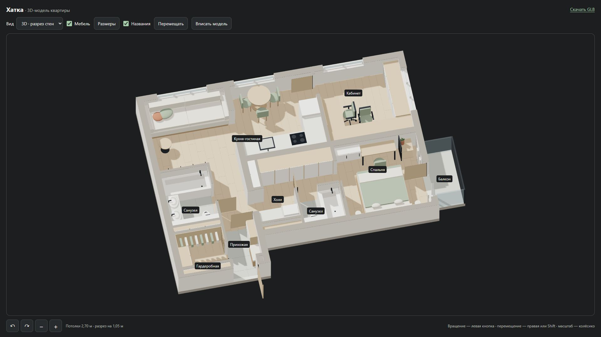
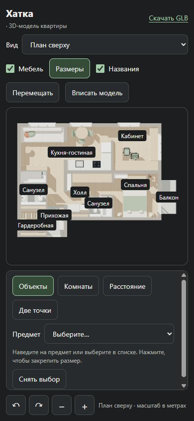
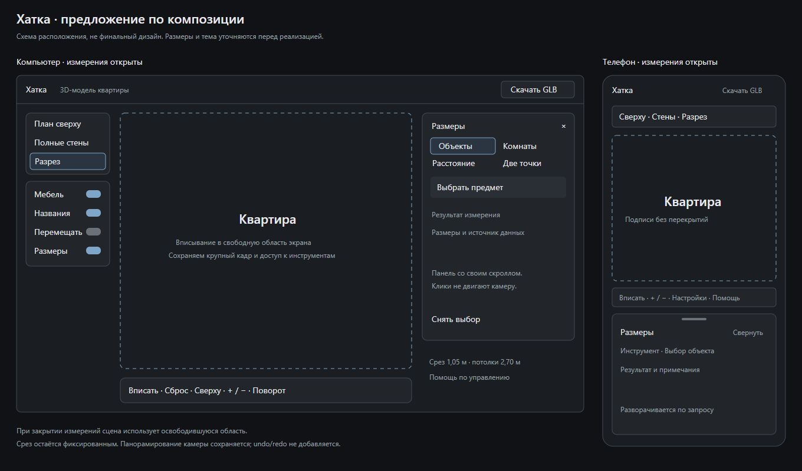

# Редизайн просмотрщика: исходная проверка R0.2

Дата: 2026-09-14. Исследование выполнено, код приложения и модель не изменены.
Это исходная точка для [плана редизайна](viewer-redesign-plan.md), а не приёмка
будущего интерфейса. Эскиз и продуктовые решения ниже имеют статус предложения;
согласие пользователя на них не предполагается из отсутствия ответа.

## Основные результаты

1. На свежей загрузке 1920×1080 в cut светлая видимая часть модели занимает
   около **88% высоты сцены** и 56% её ширины. Нажатие «Вписать модель» даёт
   те же пиксельные границы. Маленькая квартира со скриншота пользователя
   **не воспроизвелась как дефект первого открытия**. Расположение камеры
   и масштаб на пользовательском скриншоте неизвестны.
2. Resize не вызывает fit — это подтверждено кодом. В проверенном переходе
   390×844 → 1920×1080 различие небольшое: 1004×723 px до fit и 994×715 px
   после. Это не объясняет уменьшение модели вдвое на пользовательском снимке.
   Wheel действительно уменьшает модель, а fit возвращает исходный кадр.
3. Реальная проблема композиции — высокие верхние строки на телефоне и
   несворачиваемая панель измерений. В cut сцена уменьшается с 541 до 291 px
   по высоте; в full/top — с 565 до 315 px. На desktop панель занимает 320 px,
   то есть 22,2% ширины окна 1440 px.
4. В top при ширине 390 px подписи «Гардеробная» и «Прихожая» пересекаются.
   На desktop в исходных ракурсах пересечений DOM-прямоугольников подписей нет.
   В full подписи скрыты текущей логикой, в мобильном cut остаются три.
5. **sRGB, ACES Filmic и PCFSoft уже активны**, в том числе с пользовательским
   renderer. Они выставляются R3F при configure. Фаза света должна оценивать
   визуальный результат, а не повторять уже применённые настройки.
6. В тестовом вращении при 1920×1080/DPR 1 на RTX 5080 — примерно 239 FPS;
   после остановки — 0 дополнительных кадров за секунду. Это ограниченная
   исходная оценка на мощной desktop-машине, не прогноз для мобильного GPU.

## Окружение и метод

- Windows, Node 24.14.0, Vite dev-сервер, React StrictMode, текущие закреплённые
  версии пакетов. Страница `http://127.0.0.1:5173/`.
- Codex In-app Browser, Chromium 152, тёмная системная тема, DPR 1 для основной
  матрицы скриншотов и сохранённого замера производительности.
- Размеры ниже — CSS viewport, не разрешение монитора с панелями браузера.
  Основная матрица: 1920×1080, 2560×1440, 1440×900 и 390×844; каждый из
  cut/full/top с мебелью и подписями, с панелью измерений и без неё.
- Размер сцены взят из DOM `.ap-canvas-container`; canvas в каждой проверенной
  записи один. Горизонтального переполнения страницы в основной матрице нет.
- Пиксельные границы — оценка светлой видимой части модели на скриншоте:
  исключены 3 px по краям canvas, выбраны пиксели со средним RGB > 100.
  Этот метод может не учитывать тёмное/прозрачное стекло и включает светлый текст
  подписи. Он **не равен точной геометрической границе** или площади квартиры.
  Для будущих автоматических критериев fit нужна проекция геометрии, а не
  этот порог яркости.
- Скриншоты и DOM-снимки собраны через Browser. Пиксели локальных PNG прочитаны
  через Pillow/NumPy; изображения не ретушировались.
- Один ранний снимок `2560x1440-top-resize-before-fit.png` получился до завершения
  resize и имеет размер 1920×1080. Он сохранён с `validDimensions: false`
  в данных и исключён из выводов. Контрольный resize повторён с ожиданием
  завершения изменения размеров; достоверные записи имеют префикс `resize-`.
- Проверки жестов во второй части прохода пришлись на переходное масштабирование
  браузера: имена старых файлов `1920x1080-controls-*`, `pan`, `wheel-out`,
  `fit-after-wheel`, `labels-off`, `furniture-off` обозначают запрошенный размер,
  но не используются для численных сравнений. Для размеров используется только
  проверенная основная матрица и отдельные устойчивые записи resize.

Исходные данные: [DOM/layout](assets/redesign-baseline-2026-09-14/layout-observations.json),
[метрики скриншотов](assets/redesign-baseline-2026-09-14/screenshot-metrics.json),
[сравнение первого кадра с fit](assets/redesign-baseline-2026-09-14/fit-pixel-observations.json),
[устойчивый resize](assets/redesign-baseline-2026-09-14/resize-observations.json),
[пиксели после resize](assets/redesign-baseline-2026-09-14/resize-pixel-metrics.json),
[панорамирование и wheel](assets/redesign-baseline-2026-09-14/interaction-observations.json).

## Размеры и исходные кадры

В таблице доли приведены для cut. «Доля ширины/высоты» относится к светлой
видимой части в прямоугольнике сцены, а не ко всему окну.

| Viewport  | Сцена без измерений | Сцена с измерениями | Доля ширины/высоты без панели | Панель        |
| --------- | ------------------- | ------------------- | ----------------------------- | ------------- |
| 1920×1080 | 1878×903            | 1546×903            | 56,0% / 88,0%                 | 320 px справа |
| 2560×1440 | 2518×1263           | 2186×1263           | 58,5% / 88,0%                 | 320 px справа |
| 1440×900  | 1398×723            | 1066×723            | 60,2% / 88,0%                 | 320 px справа |
| 390×844   | 364×541             | 364×291             | 87,9% / 44,5%                 | 240 px снизу  |

Панель desktop уменьшает ширину, но в проверенных ракурсах cut не уменьшает
высоту квартиры: ограничивающей остаётся вертикальная ось. Для full без панели
светлая часть также занимает около 88% высоты на desktop. Для top — около 79%;
это пиксельная оценка с указанными ограничениями, не доказательство ошибки fit.

| Размер    | Разрез                                                       | Полные стены                                                  | Сверху                                                       | Разрез с измерениями                                                      | Полные стены с измерениями                                                 | Сверху с измерениями                                                      |
| --------- | ------------------------------------------------------------ | ------------------------------------------------------------- | ------------------------------------------------------------ | ------------------------------------------------------------------------- | -------------------------------------------------------------------------- | ------------------------------------------------------------------------- |
| 1920×1080 | [PNG](assets/redesign-baseline-2026-09-14/1920x1080-cut.png) | [PNG](assets/redesign-baseline-2026-09-14/1920x1080-full.png) | [PNG](assets/redesign-baseline-2026-09-14/1920x1080-top.png) | [PNG](assets/redesign-baseline-2026-09-14/1920x1080-cut-measurements.png) | [PNG](assets/redesign-baseline-2026-09-14/1920x1080-full-measurements.png) | [PNG](assets/redesign-baseline-2026-09-14/1920x1080-top-measurements.png) |
| 2560×1440 | [PNG](assets/redesign-baseline-2026-09-14/2560x1440-cut.png) | [PNG](assets/redesign-baseline-2026-09-14/2560x1440-full.png) | [PNG](assets/redesign-baseline-2026-09-14/2560x1440-top.png) | [PNG](assets/redesign-baseline-2026-09-14/2560x1440-cut-measurements.png) | [PNG](assets/redesign-baseline-2026-09-14/2560x1440-full-measurements.png) | [PNG](assets/redesign-baseline-2026-09-14/2560x1440-top-measurements.png) |
| 1440×900  | [PNG](assets/redesign-baseline-2026-09-14/1440x900-cut.png)  | [PNG](assets/redesign-baseline-2026-09-14/1440x900-full.png)  | [PNG](assets/redesign-baseline-2026-09-14/1440x900-top.png)  | [PNG](assets/redesign-baseline-2026-09-14/1440x900-cut-measurements.png)  | [PNG](assets/redesign-baseline-2026-09-14/1440x900-full-measurements.png)  | [PNG](assets/redesign-baseline-2026-09-14/1440x900-top-measurements.png)  |
| 390×844   | [PNG](assets/redesign-baseline-2026-09-14/390x844-cut.png)   | [PNG](assets/redesign-baseline-2026-09-14/390x844-full.png)   | [PNG](assets/redesign-baseline-2026-09-14/390x844-top.png)   | [PNG](assets/redesign-baseline-2026-09-14/390x844-cut-measurements.png)   | [PNG](assets/redesign-baseline-2026-09-14/390x844-full-measurements.png)   | [PNG](assets/redesign-baseline-2026-09-14/390x844-top-measurements.png)   |

Первое открытие, до каких-либо действий с камерой:

На мобильном экране все подписи в top не помещаются без пересечений:

## Проверенное взаимодействие и ограничения проверки

- Переключены все три режима и возвращение к cut, открыта/закрыта панель
  измерений на четырёх размерах. Loading сменяется готовой сценой.
- В инструменте «Объекты» выбран «Диван»: 3122×1150×950 мм, показано примечание
  об источнике размеров и схематичной высоте.
  [Снимок результата](assets/redesign-baseline-2026-09-14/1920x1080-cut-measurements-sofa.png).
- При активном «Перемещать» жест на 120 px вправо и 40 px вниз сдвигает
  первую DOM-подпись на те же 120/40 px. Это панорамирование камеры.
- Колесо отдаляет модель, fit восстанавливает координаты подписи в исходном
  ракурсе. Отключение «Названия» оставляет 0 видимых подписей; мебель визуально
  скрывается и включается обратно. Поворот кнопкой используется также в замере.
- В сохранённой [выборке консоли](assets/redesign-baseline-2026-09-14/console-observations.json)
  нет error/warn; это выборка данного запуска, а не гарантия отсутствия всех
  ошибок в остальных сценариях.
- Физические touch-жесты, загрузочная ошибка, скачивание GLB через браузер,
  полная клавиатурная приёмка и все варианты измерений здесь не проверялись.
  Нулевых размеров контейнера и новых сценариев remount в браузере не создавали.
  Они остаются в регрессионном чеклисте этапов реализации.

## Производительность

[Полный результат](assets/redesign-baseline-2026-09-14/performance-1920x1080-cut.json).
GPU: NVIDIA GeForce RTX 5080 через ANGLE/D3D11. Canvas 1878×903, DPR 1,
режим cut, мебель/названия включены, измерения закрыты. В замере участвует
тот же App и тот же viewer, подключённые из исходников на отдельной странице.

Протокол: три повтора, перед каждым восстановлен один и тот же режим камеры;
1 секунда прогрева + 4 секунды измерения. На каждом requestAnimationFrame
нажимается существующая кнопка поворота вправо (22,5° за шаг). Это синтетический
тест непрерывной нагрузки, не имитация обычной скорости движения рукой.
Считаются только кадры, в которых изменился renderer.info.render.frame.
После каждого повтора — 1 секунда покоя. На время CPU-замера включены
наблюдатели R3F до/после кадра; после повтора они удаляются.

| Повтор |   FPS | Интервал, медиана / p95 | CPU кадра, медиана / p95 | Кадры за 1 с покоя |
| ------ | ----: | ----------------------- | ------------------------ | -----------------: |
| 1      | 238,0 | 4,2 / 4,8 мс            | 3,4 / 4,1 мс             |                  0 |
| 2      | 239,1 | 4,2 / 4,7 мс            | 3,3 / 3,7 мс             |                  0 |
| 3      | 239,2 | 4,2 / 4,6 мс            | 3,3 / 3,8 мс             |                  0 |

CPU здесь включает callbacks кадра R3F и отправку команд WebGL; это не время
завершения работы GPU. FPS близок к потолку requestAnimationFrame около 240 Гц,
поэтому небольшое ухудшение может скрыться за ограничением частоты.
658 draw calls / 31004 треугольника — счётчики последнего кадра renderer,
не сумма всех GPU-проходов. Результат не является полной GPU-профилировкой.

Для повторения после изменения: `npm run dev`, открыть
`/docs/assets/redesign-baseline-2026-09-14/redesign-baseline.html`, выставить
фактический CSS viewport 1920×1080, дождаться загрузки и нажать «Замер R0.2».
[Страница](assets/redesign-baseline-2026-09-14/redesign-baseline.html) и
[измеритель](assets/redesign-baseline-2026-09-14/redesign-baseline-probe.js)
не импортируются production-входом. Измеритель использует диагностический
реестр `_roots` закреплённой версии R3F; это не предлагаемый API приложения.
Нельзя сравнивать данный dev-результат с production-сборкой или другим DPR
как стоимость одного визуального эффекта. Перед R4 следует повторить сравнение
в одном окружении и дополнить его более слабым GPU/высоким DPR, если доступны.

## Инвентаризация стилей и renderer

В `src/styles.css` 61 блок правил, 175 деклараций, 7 объявлений CSS-переменных.
Повторяемость ниже считается по точному значению декларации целиком, а не
по количеству отдельных чисел внутри составных значений:

| Значение                                  | Количество | Значение               | Количество |
| ----------------------------------------- | ---------: | ---------------------- | ---------: |
| `0`                                       |         17 | `12px`                 |          9 |
| `center`                                  |          8 | `flex`                 |          7 |
| `100%`                                    |          6 | `8px`                  |          6 |
| `none`, `grid`, `absolute`                |       по 5 | `4px`, `var(--accent)` |       по 4 |
| `16px`, `40px`, `1px solid var(--border)` |       по 3 | `var(--muted)`         |          3 |

В проверенных JSX-компонентах нет `style={{…}}`. Динамические координаты
DOM-подписей находятся в `labels.ts`, а display/cursor и SVG-атрибуты измерений —
в `measurements.ts`. Последние включают хардкод цветов `#087e9b`, `#075c72`,
белую обводку; их нужно согласовать с новой темой. Координаты проекции и размеры
canvas не превращаются в дизайн-токены.

Фактические значения из диагностического renderer:

- outputColorSpace `srgb`; toneMapping `4` (ACESFilmicToneMapping);
  exposure `1`; shadowMap.type `2` (PCFSoftShadowMap); antialias `true`;
  frameloop `demand`. DPR ограничен кодом сверху значением 2.
- Свет уже имеет основной directional с shadow map 2048, hemisphere и
  дополнительный directional. Environment, AO и отдельного contact-shadow
  прохода нет. Цвет стены `#eeeae2` уже тёплый и не чисто белый.

Основания: [styles](../src/styles.css), [labels](../src/viewer/labels.ts),
[measurements](../src/viewer/measurements.ts), [renderer](../src/viewer/index.tsx),
[сцена](../src/viewer/ApartmentScene.tsx),
[ресурсы](../src/viewer/scene-resources.ts),
[палитра генератора](../src/modeling/core/materials.ts).
Назначение sRGB/ACES дополнительно сверено с установленным R3F 9.7.0:
`node_modules/@react-three/fiber/dist/events-b1bdeb1a.cjs.dev.js`, строки
15923–15929; soft shadows — строки 15910–15921.

## Эскиз и решения D1–D5

[Редактируемый SVG](assets/redesign-baseline-2026-09-14/layout-proposal.svg).
Это схема зон, не финальная типографика или масштаб деталей интерфейса.
При открытых измерениях горизонтальный блок камеры позволяет не занимать
правый нижний угол второй вертикальной панелью. Его форма и место ещё обсуждаются.

| Решение                | Рабочее предложение после проверки                                                                                                                                                                                                                     | Статус                                                                                                                      |
| ---------------------- | ------------------------------------------------------------------------------------------------------------------------------------------------------------------------------------------------------------------------------------------------------ | --------------------------------------------------------------------------------------------------------------------------- |
| D1 — токены            | Сохранить 22 базовых токена брифа и добавить недостающие семантические токены типографики, размеров, фокуса и задержек в тот же файл. Координаты сцены не токенизировать                                                                               | Деталь реализации для R1.1; не вводит зависимостей                                                                          |
| D2 — композиция        | Тёмная тема; плавающие инструменты слева; измерения справа на desktop, сворачиваемая нижняя панель на телефоне. Fit учитывает реально свободную область                                                                                                | Эскиз предложен пользователю; ответ на вопрос о теме/размещении ещё не получен                                              |
| D3 — подписи           | Использовать существующие точки без правки модели. Не выводить неподтверждённые площади. В full пока сохранить скрытие; в top ввести разрешение коллизий вместо безусловного показа всех подписей                                                      | Проверяемый критерий для R3.1; конкретные приоритеты подготовить перед этой задачей                                         |
| D4 — fit               | Сохранить текущий целевой масштаб 88% по ограничивающей оси свободного прямоугольника, около 6% поля с каждой стороны. Полностью помещать геометрию; не требовать одинаковой заполненности обеих осей. Fit сохраняет ракурс, reset возвращает исходный | Рекомендация по измерениям; заменяет предварительные 8–10% с каждой стороны, которые уменьшили бы уже крупный исходный кадр |
| D5 — качество/скорость | Цель — исходная скорость. Предлагаемый допустимый предел — снижение медианного FPS максимум на 15% при заметном улучшении; оценивать также CPU p95 и итог всех эффектов. В покое 0 кадров после завершения анимаций                                    | Пользователю предложен выбор между бюджетом 15% и отсутствием снижения FPS; до R4 не считать выбор сделанным                |

Требование «панели не больше 20% ширины» следует уточнить: предлагается применять
его к постоянным инструментам, а открытую панель измерений учитывать отдельно
при расчёте свободной области. Иначе несколько доступных одновременно групп
плохо помещаются в суммарные 288 px на 1440×900. Исключение не считается
согласованным автоматически. Данные измерений и доступные инструменты не удалять
ради выполнения процентного ограничения.

Проверяемые критерии следующего этапа композиции: один canvas на весь viewport,
основные действия доступны без прокрутки страницы, панель измерений имеет свой
скролл и не перехватывает жесты сцены вне своей области; fit после загрузки,
смены вида, завершения resize и изменения доступной области даёт одинаковый
результат при одинаковом ракурсе. Подписи и SVG-размеры обновляются с камерой.
При открытии/закрытии измерений проверить, не мешает ли автоматическое fit
пользователю, который уже приблизил выбранный предмет: точное поведение
нужно решить перед реализацией R2.1/R2.3.

## Дальнейший порядок

Исследовательская часть R0.2 завершена: есть исходные кадры, фактические настройки,
замеры, список проблем и эскиз. D2/D5 и исключение из лимита 20% остаются
продуктовыми предложениями, не утверждёнными решениями.
Следующая реализация — R1.1, токены и локальный шрифт, затем демо примитивов.
R2.1 уточняется как улучшение использования свободной области и resize;
«сломанный первоначальный fit» не подтверждён и не должен задавать объём правки.

Существующий warning Vite о viewer chunk остаётся отдельным вопросом оптимизации
загрузки. Браузерный baseline не даёт основания менять зависимости, генератор,
экспорты, настройки сборки или реализовывать редактор мебели.

## Проверки артефактов

После сохранения отчёта и диагностических материалов прошли `typecheck`,
все 47 Node-тестов, `build` с `model:check`, общий `format:check` и
`git diff --check`. Относительные ссылки отчёта, плана и current-state проверены.
`git diff --exit-code -- src scripts tests public/models tsconfig.json`
подтверждает отсутствие содержательных изменений приложения и экспортов.
Сборка сохранила прежние имена JS/CSS с хешами; warning о viewer chunk остался.
